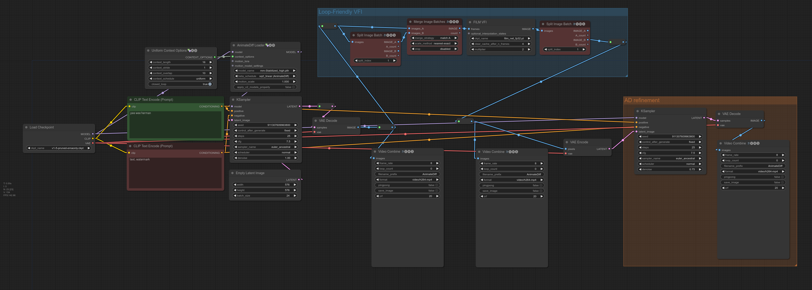
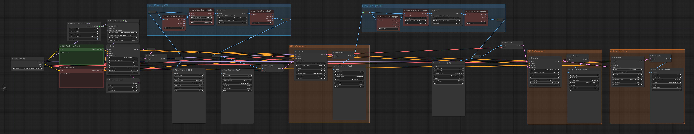
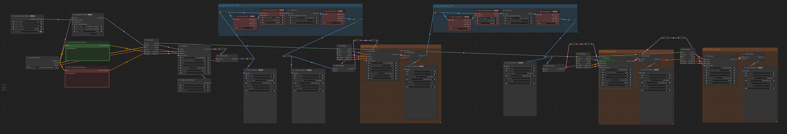

# DigThatData's Advanced ComfyUI Tips and Tricks!

Apparently I've been attempting to share workflows on social platforms that were cleaning the metadata from the images! Whoops!

My goal here is mainly to encapsulate specific tips and tricks that can be incorporated in larger workflows, rather than publishing standalone, "do everything" workflows. 

The reason for this is that... well, that's just not how I use comfyui. I'll usually start from a base "simple" workflow, and build up a piece as I interact with it. My process tends to be very organic in this way, so by the time I'm finally happy with a piece: it probably has its own unique workflow. Rather than turning this into a gallery to show off how much effort goes into each piece, I'm going to try to use this space mainly to share more "atomic" techniques that I sometimes use.

To use the techniques described here, the easiest approach is probably to open up a **second** comfyui browser tab, load the my workflow you're interested in there (i.e. drag the png image onto the comfyui workspace), select and copy the nodes that comprise the trick, then go back to your main comfy tab and paste that chunk of the my workflow into your workspace.

## My "Base" Workflow

This is usually what I start with. The left hand side is a normal text-to-image workflow that generates a batch of images. I use that space to workshop my prompt and other core conditioning and aesthetics. The right hand side is a sequence of AnimateDiff (AD) modules that are each disconnected from their respective "latent" inputs. When I'm happy with my prompt and ready to move on to animating, I just close the connection between the reroute nodes to activate the next AD module. Alternatively, if I want to add one of my "secret sauce" tricks, i can copy the nodes in one of the blue groups and add that module in-line to intercept the latents/images before passing them along to the next AD module. 

Did I mention I generally apply AD multiple times? I usually run at least two or three passes of AD when I use it. I like to think about denoising diffusion as a kind of generic "decorruption" process. As such, repeatedly applying denoising procedures can be interpreted as a kind of iterative "refinement" of an image. Just like how repeatedly applying denoising steps refines the image, we can repeatedly apply img2img (aka "loopback") to clean up a single image, or even repeatedly apply AnimateDiff to clean up an animation. 

The "bus" nodes used here aren't an intrinsic part of the workflow, I just find them useful for keeping my stuff organized. 

## Loop-Friendly Video Frame Interpolation (VFI)

A spectacular trick you can use to make smoother animations is to use frame interpolation (and/or slow down the frame rate in tandem with using VFI to elongate your frame count). I enjoy making short animated loops, which doesn't work well with this approach. Let's say we want to use VFI to interpolate 4 new frames between every frame we generated. Let's say we have a three frame animation, comprised of frames A, B and C. After VFI, we'll have 11 frames: A <4x VFI> B <4xVFI> C. The issue here is that we didn't add frames interpolating from C back to A, so when the video loops it'll seem to accelerate or "jerk" at the loop point. To fix this, we can concatenate the first frame on to the end, giving us the sequence ABCA, perform our interpolation like before, and then just pop off either of the redundant duplicated frames of the animation. Rather than 11 frames, well end up with 15 frames and a smooth loop with no jerkiness from changing frame rates.

## Alternating AD and VFI

Different AI techniques have different aesthetics. Finishing off a piece with VFI can give it a particular look that might not be desirable or might overwhelm certain aethetics of the animation before it was applied. To overcome this, I sometimes re-encode the animation back into the SD latent after applying VFI, and apply additional AD refinement passes. 

I've also found that by alternating VFI and AD, I can take a jerky animation and force it be smooth in a way that retains the AD motion aesthetics.

## Cable Management with Bus Nodes and Reroutes

Building up workflows progressively with modules like this can leave a confusing tangled web of connections in its wake. I like to use reroutes and "bus" nodes to manage this complexity. Additionally, I will sometimes double up reroutes to create a kind of "latch". If I want to rework the prompt, I can break the connection to downstream nodes while I workshop and iterate. The double reroutes makes it visually very clear to me where these "breaks" are if I have added them and make it hard for me to incorrectly rewire things when I want to resume the downstream processing.

